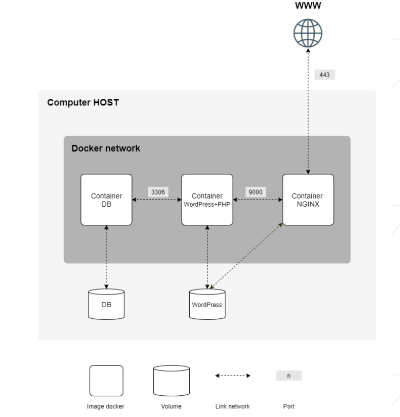

# Inception (42 project)
This repo is System Adminstration exersice based on Docker

## Description
This project aims to broaden knowledge of system administration by using Docker. \
Goal is to virtualize several Docker images, creating them in new personal virtual machine. \

It was set up:
1. A Docker container that contains NGINX with TLSv1.2;
2. A Docker container that contains WordPress + php-fpm (it was installed and configured) only without nginx;
3. A Docker container that contains MariaDB only without nginx;
4. A volume that contains WordPress database;
5. A second volume that contains WordPress website files;
6. A docker-network that establishes the connection between your containers;
7. Adminer for WordPress;
8. Redis cache for WordPress;

The domain to use is "jobect.42.fr". The DB has Administrator and common user availability. \
## Scheme

## How to build
You shuld have Docker and docker-compose installed in your teminal. \
Run `make` to build containers. \
To authorise DB and Wordpress just use **.env** file that contains login and password
